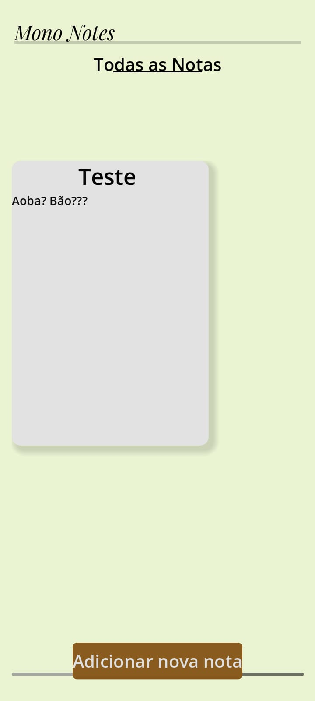
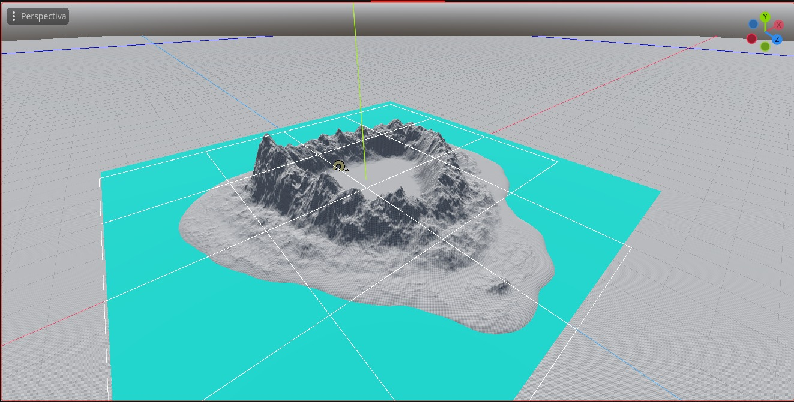

<body style="background-color:black; color:white;">

  
Aoba!!
  Sou Mun, ou melhor, esse é meu CodeName na internet, sou um progamador que gosta de inventar coisas que não vão me beneficiar,
  mas gosto do que faço, mesmo que seja inútil.

  <h1>Vozes do Horizonte - 13/01/25 01:08 AM</h1>
  
Atualmente venho tentando desenvolver um jogo 3D em primeira pessoa, meu objetivo inicial era fazer um projeto pequeno apenas para aprendizado pessoal, mas achei e, ainda acho, que seria interessante
se eu pudesse levar isso mais a sério, tipo, fazer um jogo e publicar, acredito que nunca levei um jogo tão a serio, mas confesso que estou me divertindo muito tendo ideias e
fazendo roteiros, mesmo que eu ainda não tenha um protótipo funcional do jogo com todas as funcionalidades além de um player que pode andar por um mapa vazio de uma ilha vejo uma certa
evolução no que faço, apesar de que tenho focado muito em gráficos ao invés de funcionalidade, sei que posso deixar isso pra depois mas.. sei lá, por algum motivo sempre acabo voltando pra mesma parte onde
eu crio um objeto 3D da ilha, ponho textura, coloco decoração como àrvores, pedras e grama, depois fico sem saber o que fazer e deixo o projeto de lado por um tempo, tenho que para com isso e ralmente
fazer o jogo em sí, espero que dê certo, enfim, mal vi o tempo passar enquanto escrevia esse post, a ideia de um microblog extremamente simples realmente é divertida, até a próxima, talvez. :D

<h1>14/01/25 01:03 AM</h1>

Hoje (no caso ontem) não foi lá um dia muito produtivo ou algo do tipo, tentei mexer no meu jogo, o vozes do horizonte mas acabei com um problema de performance com as folhas de grama, tenho que optimizar o modelo 3D dela.
Também comecei a fazer um aplicativo simples de anotações, é mais para aprendizado e uso pessoal, mas notei um pouco de dificuldade em fazer aplicativos fora do ramo dos games dentro de uma game engine, será por que? haha,
Penso seriamente em tentar voltar para o Flutter, mas a curva de aprendizado pode ser bem grande e complicada, amo flutter mas ele é meio complexo para meu cérebro de chimpanzé... To muito interessado por shaders e progamação visual,
quero fazer uma engine de física, mesmo que seja pelo terminal etc... Deve ser divertido entender como isso funciona, bom, também notei que, por coincidência eu também estou publicando essa atualização uma da manhã, tenho que dar um jeito
no meu sono, sério, ontem fui dormir 4 da manhã haha.. De qualquer modo, vou tentar equilibrar o desemvolvimento do meu jogo como outros projetos que faço por diversão, acredito que devo terminar meu app de notas e usar ele para me ajudar
a organizar meu jogo, um trabalho para fazer outro trabalho, sério, tenho problemas de cabeça... Até uma próxima, tenho animes me esperando agora.

 PS: agora são 1:29 AM, FINALMENTE mudei a base do blog para HTML e CSS (Bem vindo aos anos 90), então... Tema Escuro FINALMENTE!!!!

<h1>14/01/25 23:28 PM</h1>

Hoje fiz bastante progresso, optimizei o modelo 3D das gramas, fiz um mapa e terminei meu aplicativo de notas, agora posso focar 100% do meu tempo no jogo, bom
acredito que as coisas vão começar a andar, já que com o mapa pronto agora posso ir para as funcionalidades reais do jogo, mas tenho que me lembrar de adicionar texturas melhores e definitivas, também quero tentar fazer um sistema de àgua, já que boa parte do jogo se passa nela, quero fazer sistemas de barcos etc... Bom, agora é ir
desenvolvendo!

<h1>06/02/25 16:14</h1>

Oi.. Quanto tempo eu acho, bom muitas, muitas coisas aconteceram, e.. como posso dizer? Desanimei talvez, o projeto do vozes do horizonte atualmente ta arquivado, e pra ser sincero eu não
sinto a mínima vontade de voltar com ele, ou melhor, parei todos os projetos que citei antes, comecei novos, to fazendo um jogo sobre dungeons com geração procedural infinita chamdo Dungeons Dungeons e mais Dungeons.
Bom, a verdade é que comecei a dar pequenas aulas de informática, e digo uma coisa, elas não me vem fazendo bem, recentemente fui laudado com autismo, depressão e ansiedade, pensei que não
iria alterar muita coisa, mas querendo ou não, isso me afeta muito, hoje, ou melhor, uns minutos atras, uma garota acabou entrando na minha sala, questionei sobre ela não ser da minha classe, 
ela acabou me respondendo de forma agressiva, mantive a calma perto dela, mas confesso que por dentro estou.. morrendo de ansiedade haha, é desesperador e angustiante ao mesmo tempo, impressionante
bom, só queria dar uma desabadfada, não sei se vou continuar com o blogue, talvez, mas não tenho certeza, acho que devo re-fazer um do zero, ou re-começar esse, bom obrigado por ter lido essa atualização.

</body>
